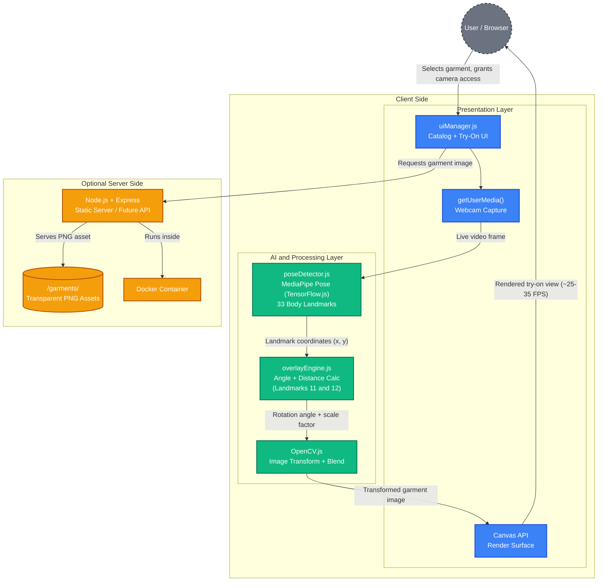

# FitVibe

An AI-driven, browser-based web application for live virtual clothing try-on. FitVibe uses real-time pose estimation and computer vision to let users see how garments look on their body instantly, using only a webcam — no app installs, no external hardware, and no data leaving the browser.

## Features

- **Real-Time Virtual Try-On:** Detects shoulder landmarks and overlays garment images on the live video feed, adjusting position, scale, and rotation as the user moves.
- **Landmark-Based Garment Alignment:** Uses MediaPipe Pose's 33 body landmarks (focused on landmarks 11 and 12 — the shoulders) for accurate, realistic garment placement.
- **Interactive Clothing Catalog:** Browse and switch between garments, rendered instantly on selection.
- **Privacy-First Architecture:** All AI processing runs client-side in the browser. No video or personal data is ever uploaded or stored.
- **Responsive, Cross-Device UI:** Adapts to desktop, tablet, and mobile screens using CSS Grid and a mobile-first layout.
- **Docker Ready:** Fully containerized for consistent, easy deployment across environments.

## Architecture

FitVibe uses a modular, three-layer architecture built for performance, scalability, and maintainability. The system runs entirely client-side, with an optional backend for future expansion.



**How it works:** The AI layer detects the shoulder landmarks (11 and 12) in each video frame, calculates the angle and distance between them, and passes that data back to the presentation layer, which rotates, scales, and positions the selected garment image on the canvas in real time — all at roughly 25-35 FPS.

## Quick Start

### Prerequisites

- **Docker & Docker Compose** (recommended), or
- A modern web browser (Chrome, Firefox, Safari) with webcam access
- **Node.js 18+** (for local development with the optional backend)

### Installation with Docker (Recommended)

1. **Clone the repository**
```bash
git clone https://github.com/yourusername/FitVibe.git
cd FitVibe
```

2. **Build and start the container**
```bash
docker build -t fitvibe .
docker run -p 8080:8080 fitvibe
```

3. **Access the application**
- App: http://localhost:8080

### Installation for Local Development

1. **Clone the repository**
```bash
git clone https://github.com/yourusername/FitVibe.git
cd FitVibe
```

2. **Install backend dependencies (optional)**
```bash
npm install
```

3. **Start the backend server (optional)**
```bash
node app.js
```

4. **Serve the frontend**

FitVibe's frontend runs entirely in the browser and can be served with any static file server, for example:
```bash
npx serve .
```

5. **Open the app and allow camera access**

Navigate to the served URL, select a garment from the catalog, and click "Try It On" to activate the webcam.

## Project Structure

```
fitvibe/
├── index.html              # Main entry page
├── styles.css               # Global and responsive styling
├── app.js                   # Application bootstrap and render loop
├── /garments/                # Transparent PNG clothing assets
├── /models/                  # MediaPipe Pose model scripts
├── /utils/
│   ├── poseDetector.js      # Pose detection and landmark tracking
│   ├── overlayEngine.js     # Garment alignment, scaling, and rendering
│   └── uiManager.js         # UI interactions and responsiveness
├── /public/                  # Static assets
├── Dockerfile
└── README.md                 
```

## Docker Deployment

FitVibe ships with a `Dockerfile` so the whole app can be built into a single image and run consistently on any machine with Docker installed.

### Build the Image

From the project root (where the `Dockerfile` lives):
```bash
docker build -t fitvibe .
```
- `-t fitvibe` tags the image as `fitvibe` so it's easy to reference afterward
- The `.` tells Docker to use the current directory as the build context

### Run the Container

```bash
docker run -d -p 8080:8080 --name fitvibe-app fitvibe
```
- `-d` runs the container in the background (detached mode)
- `-p 8080:8080` maps the container's port to `localhost:8080` on your machine
- `--name fitvibe-app` gives the running container a friendly name
- Once running, open http://localhost:8080 in a browser and allow camera access to use the app

### Useful Commands

```bash
# View container logs
docker logs -f fitvibe-app

# Stop the container
docker stop fitvibe-app

# Remove the container
docker rm fitvibe-app

# Rebuild the image after making code changes
docker build -t fitvibe .
```

### Notes

- Since all pose detection and rendering happen in the browser, the container only needs to serve static files (and, optionally, the Node.js/Express backend) — no GPU or special runtime is required inside the container
- To use a different local port, change the first number in the `-p` flag, for example `-p 3000:8080`

## Key Technologies

| Layer | Technology |
| --- | --- |
| Frontend | HTML5, CSS3, Vanilla JavaScript, Canvas API |
| Pose Detection | MediaPipe Pose (Google), via TensorFlow.js |
| Image Processing | OpenCV.js |
| Backend (optional) | Node.js, Express.js |
| Deployment | Docker, Nginx (optional) |
| Version Control | Git, GitHub |

MediaPipe Pose was chosen for its speed and accuracy while running fully client-side (no server or GPU required), which keeps the system lightweight, private, and usable on modern phones and laptops alike.

## Development

### Core Logic

```bash
# Landmark detection and garment overlay logic live in /utils
# poseDetector.js    -> tracks and returns body landmarks
# overlayEngine.js   -> computes rotation/scale and draws the garment
# uiManager.js        -> handles catalog and camera UI state
```

### Backend Development (Optional)

```bash
# Install dependencies
npm install

# Run the server
node app.js

# Serves static garment assets and future API endpoints
```

## Performance

- **Average Frame Rate:** ~25-35 FPS across desktop and mobile browsers
- **Latency:** ~90-130 ms between movement and overlay response
- **Pose Detection Accuracy:** 96% under stable lighting with a still user, 75-91% under motion or challenging conditions
- **User Satisfaction:** 91% overall satisfaction, 95% ease of use, 90% visual accuracy approval (based on internal user testing)

## Limitations

- Currently supports upper-body garments only (shirts, tops)
- Garments are rendered as flat 2D images without fabric physics
- Accuracy depends on camera quality and lighting conditions
- No automatic size/fit suggestions
- Garment images require manual preparation (transparent PNG, centered, consistent aspect ratio)

## Future Directions

- Full-body try-on support (pants, dresses, shoes)
- AI-based size and fit suggestions
- Integration with e-commerce platforms such as Shopify
- In-store smart mirror deployment
- 3D avatars and AR-based try-on experiences

## Security and Privacy Considerations

- All pose detection and garment rendering happen locally in the browser — no video or images are uploaded or stored
- No user registration or personal data collection required
- Designed with GDPR-aligned, privacy-first principles
- Optional backend limited to serving static assets, reducing server-side attack surface

## License

This project is licensed under the MIT License - see the LICENSE file for details.

## Contributing

Contributions are welcome! Please:

1. Fork the repository
2. Create a feature branch (`git checkout -b feature/amazing-feature`)
3. Commit your changes (`git commit -m 'Add amazing feature'`)
4. Push to the branch (`git push origin feature/amazing-feature`)
5. Open a Pull Request